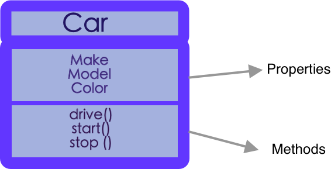

# jsCalc
IS219 1st project

###Direction:

-1 Clone repo

-2 cd into repo

-3 run "npm install"

**
 #OOP (Object-Oriented Programming) 
** 

Object-oriented programming is a programming paradigm centered around object rather than functions. 
It has been around since the 70's. Many programming languages adopted OOP like c#, java, Python, Ruby... 
Even some frameworks are designed with oop concept in mind such us Angular.
As a developer oop consist a great tool that make him/her stands out in job interviews.
we use objects in coding without even noticing.

~~~javascript
const s = "Hello World";
console.log(s.toLowerCase());
console.log(typeof (s));

//even when s is a string (primitive), it is basically an object (implicitly)and toLowerCase() is a method of that object
~~~
output
~~~bash
hello world
string
~~~

to proof that, let us use string as an object explicitly

~~~javascript
const s = new String("Hello World");
console.log(s.toLowerCase())
console.log(typeof (s));
~~~
output
~~~bash
hello world
object
~~~

have you noticed that console is an object and .log() is a method of that console object as well?

OOP is based on 4 pillars:

###1- Abstraction:

Imagine you bought a car to drive, and you press the brake to stop it at a red light, do you really need to know how the brake system is working or what the engine does while stopped at the red light?

in the cae of a calculator, there is a complex way to find a solution for square root of a number, but as a user, you don't care about the hidden details and just care about the correct result.
the encapsulation is hiding a form of trust between the creator and the user of the function.

Benefits of Abstraction:
* **Ease of use**: no need to know all the details of the functions to use them
* **Update Proof**: the object will behave the same even if the functions are refactored or updated

###2- Encapsulation:
the term itself means to enclose things in a capsule. in other words, if you notice that many things can go together, you can encapsulate them in 1 enclosure.
in coding, if you notice that many variables and functions are related to a common bigger concept, you can add them all together in 1 object. the variable will become properties, and the functions will be called methods.

in the case of the code uin this repo, the calculator class will encapsulate all necessary and related methods and properties in it so when you create an instance of the calculator , you will have access to all related functions that are useful to you.

encapsulation will help create function that has no parameters as the parameters are simply  properties of the object instantiated.  as Robert Cecil Martin, colloquially called "Uncle Bob", said  
> > "The best functions are those with no parameters"
###3- Inheritance:

inheritance allows us to avoid to type redundant code. 

###4- Polymorphism:
Poly means Many and Morph means shape. It allows us to get rid of long code and many if statement or switches in our code.

#
 S.O.L.I.D. 
 

###1- S – Single Responsibility Principle:

each function should be responsible for one and only one responsibility.
in the code in this repo each simple operation like sum, product ... is in a separate function and even in a separate file.

~~~javascript
function Sum(a,b){
    return a + b;
}
~~~

sum is a very simple function which will make it error proof and easy to read or debug.
longer and complex functions are harder to maintain.
Solid design is shown in the naming of functions as the reading the name of the function should show no more than 1 responsibility. 

###2- O – Open-Closed Principle:

Software elements (classes,modules,functions, etc...) should be open for extension but closed for modification.
it sounds confusing:confused:. I know.

this means that you can build classes in a way that you can extend them via inheritance and child classes, but the parent class that you have created should not be modified.

###3- L – Liskov Substitution Principle:

###4- I – Interface Segregation Principle:

###5- D – Dependency Inversion Principle:

